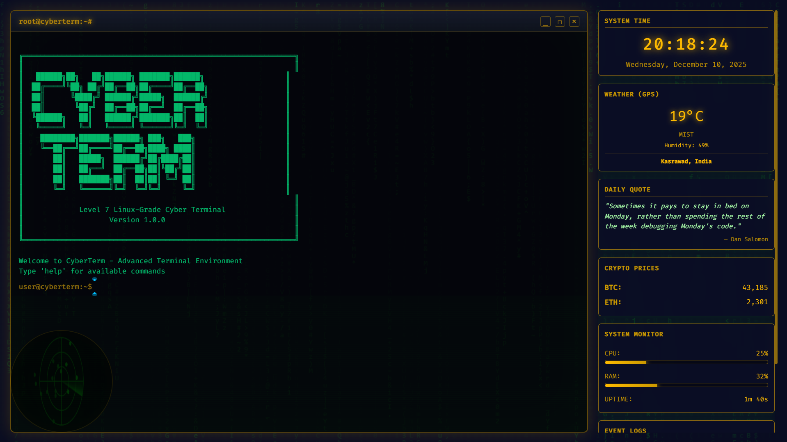

# 🚀 CyberTerminal - Level 7 Linux-Grade Terminal for Chrome


A fully functional, Linux-grade terminal emulator that replaces your Chrome New Tab with a powerful cyber-themed command-line interface. Built with vanilla JavaScript, featuring a complete virtual filesystem, real-time widgets, and authentic terminal experience.

---

## 📸 Screenshots



---

## ✨ Features

#### New Tools (v1.1)

- **Calculator**: In-terminal math evaluation (`calc`).
- **Bookmark Manager**: Save and open your own links (`bookmark`, `open`).
- **Password Gen**: Create secure passwords instantly (`passgen`).
- **Zen Mode**: Hide widgets for focused work (`zen`).
- **Aliases**: Create your own command shortcuts (`alias`).

### 🖥️ Terminal Emulator

- **Full Linux Shell Simulation** - 50+ authentic terminal commands
- **Virtual Filesystem** - Complete file/directory operations with persistence
- **Command History** - Full history with ↑↓ navigation (unlimited storage)
- **Tab Completion** - Smart autocomplete for commands and filenames
- **Command Chaining** - Support for `;`, `&&`, and `|` operators
- **Keyboard Shortcuts** - Ctrl+L (clear), Tab (autocomplete), arrows (history)

### 🎨 Visual Features

- **5 Cyber Themes** - Matrix (green), Kali (blue), Ubuntu (orange), Neon Purple, Hacker Amber
- **CRT Scanline Effect** - Authentic terminal look
- **Boot Sequence** - Linux-style startup animation
- **Smooth Animations** - GPU-optimized effects

### 📊 Real-Time Widgets

- **⏰ Clock** - Live time and date
- **🌤️ Weather** - GPS-based weather (WeatherAPI integration)
- **💰 Crypto Prices** - Real-time BTC/ETH prices (CoinGecko API)
- **💭 Daily Quotes** - Inspirational programming quotes
- **📊 System Monitor** - Real CPU & RAM usage (browser-based)
- **📝 Event Logs** - System activity monitoring

---

## 🚀 Installation

### Method 1: Load Unpacked (Developer Mode)

1. **Download the Extension**

   ```bash
   git clone https://github.com/rehankumar554/cyberterminal.git
   cd cyberterminal
   ```

2. **Open Chrome Extensions**

   - Navigate to `chrome://extensions/`
   - Enable "Developer mode" (top-right toggle)

3. **Load Extension**

   - Click "Load unpacked"
   - Select the `cyberterminal` folder
   - Extension will appear in your extensions list

4. **Open New Tab**
   - Open a new tab (Ctrl+T)
   - CyberTerminal will load automatically!

### Method 2: Chrome Web Store (Coming Soon)

- Search for "CyberTerminal" in Chrome Web Store
- Click "Add to Chrome"

---

## ⚙️ Configuration

### Weather Widget Setup

1. Get free API key from [WeatherAPI.com](https://www.weatherapi.com/signup.asp)
2. Open `widgets.js` (line 3) or `api.js` (line 4)
3. Replace `YOUR_WEATHERAPI_KEY_HERE` with your API key
4. Reload extension

```javascript
// In widgets.js line 3
const API_KEY = "your_actual_api_key_here";

// In api.js line 4
this.weatherApiKey = "your_actual_api_key_here";
```

### Theme Customization

```bash
# In terminal, type:
theme set matrix        # Green Matrix theme
theme set kali          # Blue Kali theme
theme set ubuntu        # Orange Ubuntu theme
theme set neon-purple   # Purple neon theme
theme set hacker-amber  # Amber hacker theme
```

---

## 📖 Command Reference

### 📁 File System

| Command           | Description                         | Example                  |
| ----------------- | ----------------------------------- | ------------------------ |
| `ls [path]`       | List directory contents             | `ls`, `ls -a`            |
| `cd <path>`       | Change directory                    | `cd /logs`, `cd ..`      |
| `pwd`             | Print working directory             | `pwd`                    |
| `cat <file>`      | Display file contents               | `cat welcome.txt`        |
| `touch <file>`    | Create new file                     | `touch myfile.txt`       |
| `rm <file>`       | Remove file                         | `rm oldfile.txt`         |
| `mkdir <dir>`     | Create directory                    | `mkdir projects`         |
| `rmdir <dir>`     | Remove directory                    | `rmdir old_folder`       |
| `cp <src> <dest>` | Copy file (-r for recursive)        | `cp file.txt backup.txt` |
| `mv <src> <dest>` | Move/rename file or directory       | `mv old.txt new.txt`     |
| `head <file>`     | Show first 10 lines (-n for custom) | `head readme.md`         |
| `tail <file>`     | Show last 10 lines (-n for custom)  | `tail logs.txt`          |
| `wc <file>`       | Count lines, words, characters      | `wc welcome.txt`         |

### 🔍 Search & Filter

| Command                 | Description                      | Example                  |
| ----------------------- | -------------------------------- | ------------------------ |
| `find <pattern>`        | Find files by name/pattern       | `find *.txt`             |
| `grep "pattern" <file>` | Search text in file (-r for dir) | `grep "Linux" readme.md` |
| `ls \| grep ".txt"`     | Filter command output            | `ls \| grep ".txt"`      |

### ✅ Productivity

| Command           | Description              | Example                 |
| ----------------- | ------------------------ | ----------------------- |
| `todo add <task>` | Add item to Todo list    | `todo add "Buy milk"`   |
| `todo list`       | Show Todo list           | `todo list`             |
| `todo done <num>` | Mark task as completed   | `todo done 1`           |
| `note <text>`     | Save a quick note        | `note "Meeting at 3pm"` |
| `notes list`      | View saved notes         | `notes list`            |
| `timer <time>`    | Set timer (10s, 5m, 1h)  | `timer 25m`             |
| `alarm <HH:MM>`   | Set alarm (24h)          | `alarm 14:30`           |
| `calc <expr>`     | Evaluate math expression | `calc 10 + 5 * 2`       |
| `passgen [len]`   | Generate password        | `passgen 16`            |

### 🌐 Web Search

| Command                 | Description                       | Example                      |
| ----------------------- | --------------------------------- | ---------------------------- |
| `google <query>`        | Search Google                     | `google javascript tutorial` |
| `youtube <query>`       | Search YouTube                    | `youtube funny cats`         |
| `github <query>`        | Search GitHub                     | `github reactjs`             |
| `stackoverflow <query>` | Search StackOverflow              | `stackoverflow center div`   |
| `wiki <query>`          | Search Wikipedia                  | `wiki Albert Einstein`       |
| `map <location>`        | Open Google Maps                  | `map New York`               |
| `translate <text>`      | Translate text                    | `translate hello en-hi`      |
| `open <service>`        | Open site (gmail, chatgpt, etc.)  | `open gmail`                 |
| `quicklink`             | List all quick links              | `quicklink`                  |
| `weather <gps>`         | Get weather (use 'gps' for local) | `weather gps`                |
| `news`                  | Fetch latest news                 | `news`                       |
| `crypto <symbol>`       | Get crypto prices (BTC, ETH)      | `crypto BTC`                 |
| `bookmark`              | Manage custom bookmarks           | `bookmark add mysite url`    |

### 🌐 Browser Tab Manager

| Command               | Description                           | Example             |
| --------------------- | ------------------------------------- | ------------------- |
| `tabs list [query]`   | List tabs (with optional search)      | `tabs list google`  |
| `tabs switch <sn>`    | Switch to tab number <sn>             | `tabs switch 2`     |
| `tabs new [n] [url]`  | Open n new tabs with optional URL     | `tabs new 2 github` |
| `tabs close <sn...>`  | Close specific tabs (space separated) | `tabs close 1 3 5`  |
| `tabs close all`      | Close all tabs in the window          | `tabs close all`    |
| `tabs reload <args>`  | Reload specific or all tabs           | `tabs reload 2`     |
| `tabs mute/unmute`    | Mute/Unmute audio                     | `tabs mute all`     |
| `tabs pin/unpin`      | Pin/Unpin tabs                        | `tabs pin 1`        |
| `tabs discard <args>` | Suspend tabs to free RAM              | `tabs discard all`  |
| `tabs dedup`          | Remove duplicate open tabs            | `tabs dedup`        |

### 🛠️ System Utilities

| Command           | Description                       | Example             |
| ----------------- | --------------------------------- | ------------------- |
| `clear`           | Clear terminal screen             | `clear` or `Ctrl+L` |
| `history`         | Show command history              | `history`           |
| `neofetch`        | Show system info (ASCII art)      | `neofetch`          |
| `date / time`     | Show current date or time         | `date`, `time`      |
| `whoami`          | Display current user              | `whoami`            |
| `sudo <command>`  | Execute as superuser (simulation) | `sudo ls`           |
| `sys.info`        | Display hardware/software info    | `sys.info`          |
| `sys.log`         | Show system logs                  | `sys.log`           |
| `dev.mode.enable` | Enable developer debug mode       | `dev.mode.enable`   |

### ⚙️ Settings & Session

| Command               | Description                | Example               |
| --------------------- | -------------------------- | --------------------- |
| `session save <name>` | Save current session state | `session save work`   |
| `session load <name>` | Load a saved session       | `session load work`   |
| `theme set <name>`    | Change theme               | `theme set kali`      |
| `set fontSize <px>`   | Adjust font size           | `set fontSize 16`     |
| `set opacity <0-1>`   | Adjust transparency        | `set opacity 0.9`     |
| `refresh`             | Refresh the terminal       | `refresh`             |
| `shortcut list`       | View custom shortcuts      | `shortcut list`       |
| `zen <on\|off>`       | Toggle Focus/Zen mode      | `zen on`              |
| `alias`               | Create command shortcuts   | `alias set cls clear` |

### 💡 Help & Fun

| Command          | Description                | Example             |
| ---------------- | -------------------------- | ------------------- |
| `help [cmd]`     | Show help menu             | `help`, `help grep` |
| `man <cmd>`      | Read manual page           | `man ls`            |
| `examples <cmd>` | Show usage examples        | `examples cp`       |
| `tutorial`       | Start interactive tutorial | `tutorial`          |
| `tip`            | Show random terminal tip   | `tip`               |
| `matrix`         | Toggle Matrix effect       | `matrix`            |
| `cowsay <text>`  | Make the cow speak         | `cowsay "Hello!"`   |

### 🔗 Command Chaining

| Command        | Description               | Example                |
| -------------- | ------------------------- | ---------------------- |
| `cmd1 ; cmd2`  | Sequential execution      | `date ; time ; whoami` |
| `cmd1 && cmd2` | Execute if first succeeds | `cd /logs && ls`       |
| `cmd1 \| cmd2` | Pipe output               | `ls \| grep ".txt"`    |

---

## ⌨️ Keyboard Shortcuts

| Shortcut            | Action                       |
| ------------------- | ---------------------------- |
| `↑` Arrow           | Previous command             |
| `↓` Arrow           | Next command                 |
| `Tab`               | Autocomplete command         |
| `Ctrl + L`          | Clear screen                 |
| `Ctrl + C`          | Cancel input                 |
| `Enter`             | Execute command              |
| `Ctrl + A`          | Move cursor to start         |
| `Ctrl + E`          | Move cursor to end           |
| `Alt + B`           | Move cursor back one word    |
| `Alt + F`           | Move cursor forward one word |
| `Ctrl + U`          | Clear entire input line      |
| `Ctrl + K`          | Delete to end of line        |
| `Ctrl + W`          | Delete previous word         |
| `Alt + .` (Dot)     | Paste last argument          |
| `Ctrl + D`          | Exit/Logout (if line empty)  |
| `Ctrl + Z`          | Suspend process (simulation) |
| `Ctrl + R`          | Reverse search history       |
| `Ctrl + G` or `ESC` | Cancel search mode           |
| `Backspace`         | Delete characters in search  |

---

## 🏗️ Project Structure

```
📦CyberTerminal
 ┣ 📂assets
 ┃ ┣ 📂image
 ┃ ┃ ┗ 📜icon.png
 ┃ ┣ 📂jsons
 ┃ ┃ ┣ 📜cmd_docs.json
 ┃ ┃ ┣ 📜commands.json
 ┃ ┃ ┣ 📜services.json
 ┃ ┃ ┗ 📜tips.json
 ┃ ┣ 📂screenshots
 ┃ ┃ ┣ 📜theme_hacker_amber.png
 ┃ ┃ ┣ 📜theme_kali.png
 ┃ ┃ ┣ 📜theme_matrix.png
 ┃ ┃ ┣ 📜theme_neon_purple.png
 ┃ ┃ ┗ 📜theme_ubuntu.png
 ┃ ┣ 📂script
 ┃ ┃ ┣ 📜api.js
 ┃ ┃ ┣ 📜fs.js
 ┃ ┃ ┣ 📜matrix.js
 ┃ ┃ ┣ 📜system.js
 ┃ ┃ ┣ 📜terminal.js
 ┃ ┃ ┣ 📜themes.js
 ┃ ┃ ┗ 📜widgets.js
 ┃ ┗ 📂style
 ┃ ┃ ┗ 📜style.css
 ┣ 📜manifest.json
 ┗ 📜newtab.html

```

---

## 🛠️ Technology Stack

- **Frontend**: Vanilla JavaScript (No frameworks)
- **Storage**: localStorage for persistence
- **APIs**:
  - WeatherAPI (weather data)
  - CoinGecko (crypto prices)
  - Custom APIs (quotes, news)
- **Graphics**: HTML5 Canvas (Matrix rain)
- **Styling**: Pure CSS with CSS variables
- **Architecture**: Modular ES6 classes

---

## 📊 Technical Features

### Virtual Filesystem

- JSON-based structure
- localStorage persistence
- Full CRUD operations
- Path resolution
- Directory traversal
- File/folder management

### Performance

- GPU-optimized animations
- Efficient DOM manipulation
- Lazy loading
- Debounced events
- Memory management

### Real-Time Monitoring

- Browser CPU usage (performance API)
- JavaScript heap memory (performance.memory)
- System uptime tracking
- Network stats simulation
- Event logging

---

## 🎯 Use Cases

- **Developers** - Quick terminal access, file management
- **System Admins** - Command practice, system monitoring
- **Students** - Learn Linux commands, practice scripting
- **Cybersecurity** - Hacking simulation, penetration testing practice
- **Power Users** - Productivity boost, custom workflows
- **Everyone** - Cool cyberpunk aesthetic!

---

## 🚧 Roadmap

### Version 1.1 (Planned)

- [ ] Browser tab management commands
- [ ] Clipboard integration
- [ ] Bookmarks management
- [ ] Download manager
- [ ] Settings panel UI
- [✓] Session save/restore
- [✓] Custom keybindings

### Version 2.0 (Future)

- [ ] AI command suggestions
- [ ] Git integration
- [ ] Code execution (JavaScript, Python)
- [ ] Multi-terminal tabs
- [ ] SSH simulation
- [ ] Package manager
- [ ] Plugin system

---

## 🤝 Contributing

Contributions are welcome! Here's how you can help:

1. **Fork the repository**
2. **Create a feature branch** (`git checkout -b feature/AmazingFeature`)
3. **Commit your changes** (`git commit -m 'Add some AmazingFeature'`)
4. **Push to the branch** (`git push origin feature/AmazingFeature`)
5. **Open a Pull Request**

### Contribution Guidelines

- Follow existing code style
- Add comments for complex logic
- Test thoroughly before submitting
- Update documentation if needed

---

## 🐛 Bug Reports

Found a bug? Please open an issue with:

- Browser version
- Extension version
- Steps to reproduce
- Expected behavior
- Actual behavior
- Screenshots (if applicable)

---

## 💡 Feature Requests

Have an idea? Open an issue with:

- Feature description
- Use case
- Expected behavior
- Priority (low/medium/high)

---

## 📝 Known Issues

- Weather widget requires manual API key setup
- Some commands may not work identically to Linux
- Browser storage limited to ~5MB per domain
- Matrix animation may affect performance on slower machines

---

## 🔒 Privacy & Security

- **No data collection** - Everything runs locally
- **No external tracking** - Zero analytics
- **No permissions abuse** - Only storage permission used
- **Open source** - Fully transparent code
- **Secure APIs** - Only HTTPS connections

---

## 🌟 Credits

### APIs & Services

- [WeatherAPI](https://www.weatherapi.com/) - Weather data
- [CoinGecko](https://www.coingecko.com/) - Cryptocurrency prices
- [Quotable](https://github.com/lukePeavey/quotable) - Quotes API

### Inspiration

- Linux/Unix terminals
- Kali Linux
- Ubuntu Terminal
- Matrix movie
- Cyberpunk aesthetic

### Fonts

- [Fira Code](https://github.com/tonsky/FiraCode)
- [Share Tech Mono](https://fonts.google.com/specimen/Share+Tech+Mono)

---

## 📄 License

This project is licensed under the MIT License - see the [LICENSE](LICENSE.md) file for details.

---

## 👨‍💻 Author

**Rehan Kumar**

- GitHub: [@Rehankumar554](https://github.com/Rehankumar554)
- Email: work.rehankumarsahu@gmail.com

---

## 🙏 Acknowledgments

- Thanks to all contributors
- Inspired by the Linux/Unix community
- Built with ❤️ for terminal enthusiasts

---

## 📞 Support

Need help?

- 📖 [Read the docs](https://github.com/rehankumar554/cyberterminal/wiki)
- 💬 [Join discussions](https://github.com/Rehankumar554/CyberTerminal/discussions)
- 🐛 [Report bugs](https://github.com/rehankumar554/cyberterminal/issues)
- ⭐ Star the repo if you like it!

---

## 📈 Stats


---

<div align="center">

**Made with 💚 by terminal enthusiasts, for terminal enthusiasts**

[⬆ Back to Top](#-cyberterminal---level-7-linux-grade-terminal-for-chrome)

</div>
